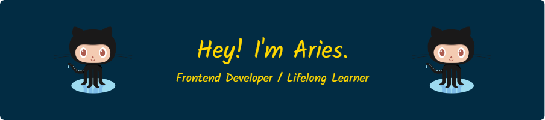

- 🌱 In the first five years of my programming career, I specialized in embedded software development with a focus on applied cryptography.
- 🔥 Now, I'm deeply fascinated with front-end technologies.

- 📝 I sometimes write articles on [urchinzhou.com](urchinzhou.com)

  

<h3 align="left">Languages and Tools:</h3>

 
  
   
   
   
   
   
   
   
  
   
   
   
   
   
   
   
   

&nbsp;

## Interesting Courses I Completed on Coursera

<table>
  <tr>
    <td></td>
    <td></td>
    <td></td>
  </tr>
  <tr>
    <td></td>
    <td></td>
    <td></td>
    
  </tr>
  <tr>
    <td></td>
    <td></td>
    <td></td>
  </tr>
  <tr>
    <td></td>
    <td></td>
  </tr>
  <!-- 更多的行 -->
</table>
